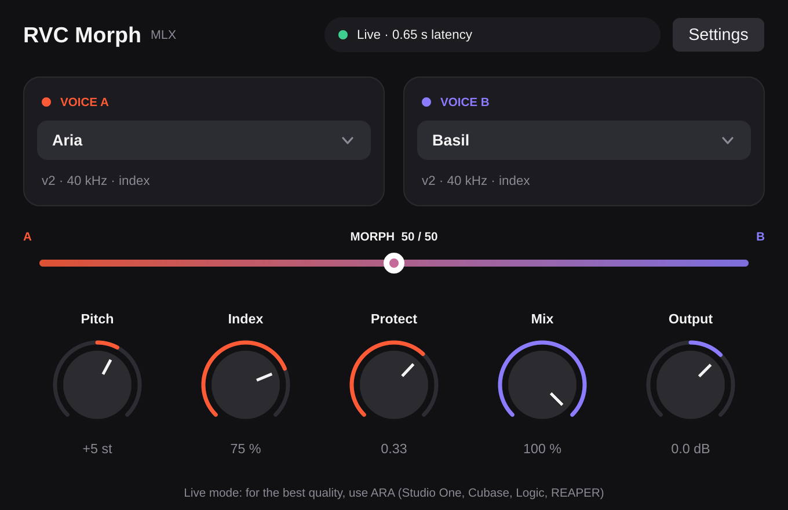

# RVC Morph: JUCE plug-in with ARA

An AU / VST3 / Standalone voice converter running RVC on Apple-silicon GPUs through MLX.

- **Two voice slots and a morph slider.** Pick voice A and voice B, then slide between them. The plug-in
  interpolates the two models' weights (RVC's *ckpt merge*, live) and mixes their retrieval indexes in proportion.
- **ARA 2 for fast, high-quality rendering.** In ARA hosts (Studio One, Cubase / Nuendo, Logic Pro, REAPER, Cakewalk)
  the plug-in reads each clip directly, converts it once in the background with the full offline pipeline, and plays
  the result back with zero latency. Edits to a clip or to the controls re-render only what changed. The original
  audio plays until a clip is ready, so playback never drops out.
- **Live mode everywhere else.** Without ARA it converts the incoming audio in 0.3 s hops with SOLA crossfades and
  reports its latency (about 0.65 s) to the host for delay compensation.
- Pitch (semitones), Index (retrieval strength), Protect (consonants), Mix (dry/wet) and Output gain.

<p align="center"></p>

## Build (macOS 14+, Apple silicon)

```bash
# 1. The ARA SDK (optional, but it's what makes the plug-in shine)
git clone --recursive --branch releases/2.2.0 https://github.com/Celemony/ARA_SDK ~/SDKs/ARA_SDK

# 2. Configure and build. JUCE 8 and MLX 0.30.1 are fetched and built automatically.
cd examples/juce-plugin
cmake -B build -G Xcode -DARA_SDK_PATH=~/SDKs/ARA_SDK
cmake --build build --config Release
```

The AU and VST3 are copied to `~/Library/Audio/Plug-Ins/{Components,VST3}`. The Standalone app is in
`build/RVCMorph_artefacts/Release/Standalone/`.

Faster builds: if MLX is already installed (`pip install mlx` or `brew install mlx`), add
`-DRVC_MLX_FROM_SOURCE=OFF -DCMAKE_PREFIX_PATH=$(python -m mlx --cmake-dir)`. To use a local JUCE checkout instead of
fetching one, add `-DRVC_JUCE_SOURCE=/path/to/JUCE`.

## Use

1. Convert your voices (see the [tutorial](../../docs/converting-models.md)). You'll end up with a folder like:

   ```
   models/
   ├── hubert.safetensors
   ├── rmvpe.safetensors
   └── voices/
       ├── alice.safetensors
       └── bob.safetensors
   ```

2. Open the plug-in, click **Settings → Choose models folder…** and select `models/`. This is remembered for all
   instances; the default is `~/Music/RVC Morph/models`.
3. Pick voice A (and optionally voice B to morph). In an ARA host, add RVC Morph as an **ARA extension** on the
   track/clip. The status pill shows rendering progress, then "ARA · N clips ready".

Morphing needs two voices with the same architecture (same RVC version and sample rate); the editor explains when
that isn't the case.

## How it's put together

| File | Role |
| --- | --- |
| `engine/` | The C++ RVC engine on MLX (HuBERT, RMVPE, synthesizer, retrieval, blending, pipeline). Plain C++17, no JUCE. |
| `Source/EngineHost` | One engine per process on a dedicated thread (all MLX work is serialised there), plus voice and blend caches. |
| `Source/ARAVoiceConversion` | ARA document controller, per-document render cache and the playback renderer. |
| `Source/StreamingConverter` | Live mode: lock-free FIFOs, windowed conversion, SOLA stitching. |
| `Source/PluginProcessor` / `PluginEditor` | Parameters, state, routing between ARA and live mode, and the UI. |

## Testing

```bash
# Engine vs the Python implementation (from the repo root, with the dev extras installed)
python examples/juce-plugin/engine/tests/make_golden.py /tmp/rvc-golden
cmake -B build-engine -DRVC_ENGINE_TESTS=ON -DCMAKE_PREFIX_PATH=$(python -m mlx --cmake-dir) examples/juce-plugin/engine
cmake --build build-engine && ./build-engine/rvc_parity_test /tmp/rvc-golden

# Plug-in smoke test: streams audio through the live path and snapshots the editor
cmake -B build -DRVC_PLUGIN_TESTS=ON ... && cmake --build build --target RVCMorphSmokeTest
./build/RVCMorphSmokeTest_artefacts/Release/RVCMorphSmokeTest models/ models/voices/alice.safetensors "" editor.png
```

## Notes

- **Distribution:** MLX loads its GPU kernels from `mlx.metallib` placed next to the plug-in binary (the build copies
  it into each bundle). Sign the bundles after building if you ship them.
- Live mode and ARA rendering share one engine thread. A long ARA render can briefly starve a live instance in the
  same process.
- Time-stretched ARA regions aren't supported (the plug-in declares no playback transformations), so hosts render
  stretched clips through their own engine first.
